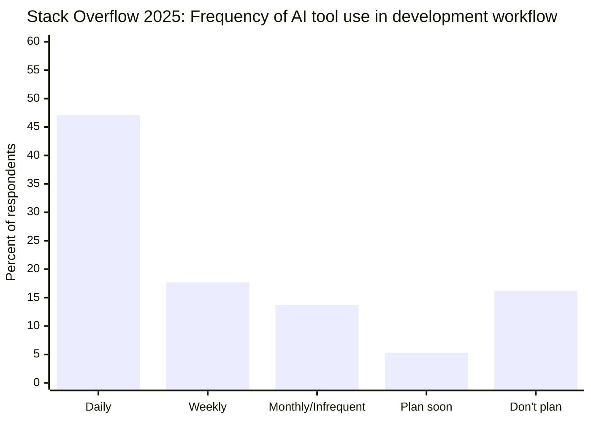
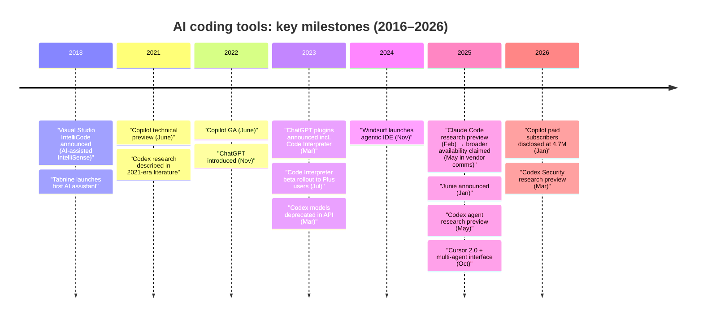

# AI Coding Tool Adoption 2016–2026

## Executive summary

Adoption of AI-assisted coding accelerated sharply after late 2021–2022 (Codex/Copilot and then chat-based LLMs), and by 2024–2025 most large surveys report that a majority of developers are using AI in their development process (or have at least tried AI coding tools). citeturn37search0turn36search1turn38search4turn14view1turn13view2  
Across widely cited multi-country surveys in 2024–2025, “current use” metrics commonly land between ~60% and ~90% (depending on question wording and sampling), while “ever used” metrics can be ~97% because they count any prior experimentation. citeturn38search2turn34view0turn14view1turn13view2  

The market bifurcated into two usage modes that behave differently in adoption, risk, and measurement: (1) assistive “copilot/autocomplete + chat” used inline for small steps, and (2) agentic/autonomous systems that plan and execute multi-step tasks (multi-file edits, running tests, proposing PRs). In 2025, one large developer survey found ~31% of respondents use AI agents at work at least infrequently (daily/weekly/monthly combined), while ~14% reported using AI only in “copilot/autocomplete mode”, and ~38% said they do not plan to use agents. citeturn4view3  

Perceived productivity gains are consistently self-reported, but they coexist with persistent trust and verification problems. In 2025, one survey reported more developers distrust AI output accuracy (46%) than trust it (33%), and “almost right but not quite” outputs (66%) plus longer debugging time (45%) were top frustrations. citeturn4view0turn5view0  
Separately, a global DevOps research program’s 2025 report found AI adoption ~90% among surveyed technology professionals and a median ~2 hours/day of AI use, while only ~24% reported “a lot” or “a great deal” of trust—summarizing the central adoption paradox: heavy usage without commensurate trust. citeturn14view1turn14view2  

“Tool penetration” data is uneven. The strongest hard numbers exist for Copilot via Microsoft earnings disclosures (4.7M paid subscribers as of FY26 Q2; “20M users” and “90% of the Fortune 100” in FY25 Q4 language), while most other tools rely on survey self-report, private-company claims, or proxy metrics. citeturn9view0turn7search2  

## Research questions

A rigorous industry analysis of AI coding tool adoption (2016–2026) is stronger when it explicitly answers these questions, separating what is measured from what is inferred:

**Definitions and scope**
- What counts as an “AI coding tool” across 2016–2026—ML-enhanced autocomplete, LLM chat, code-generation, IDE-native copilots, CLI agents, and code-review agents—and how do these categories affect adoption estimates? citeturn35search5turn35search4turn33view3turn25view0turn26search0  
- How should “assistive” versus “agentic/autonomous” use be operationalized (e.g., single-file suggestion acceptance vs. multi-step execution with tool use and PR creation)? citeturn4view3turn25view0turn26search0turn20search1  

**Adoption and market penetration**
- What is the overall adoption trajectory of AI-assisted coding from 2016–2026, and what are the best-supported quantitative inflection points (by year)? citeturn35search5turn39search0turn35search4turn37search0turn38search2turn5view3  
- For each major tool category, what is the best available “penetration” metric (paid seats, active users, “ever used”, “used in past month”, “daily use”, etc.), and which are not comparable across sources? citeturn9view0turn7search2turn34view0turn13view2turn2view1  
- How large is paid/enterprise usage vs individual usage, and how does procurement or enterprise policy constrain adoption? citeturn29search0turn34view0turn38search0turn9view0  

**Segmentation and diffusion**
- Which segments are early adopters vs mainstream vs reluctant adopters by:
  - experience/career stage; citeturn3view0turn4view0  
  - role specialization (frontend/backend/devops/data/security/embedded); citeturn13view0turn13view2  
  - company size and engineering maturity; citeturn30view0  
  - regulated vs less regulated industries and organizational policy posture; citeturn38search0turn29search0turn14view2  
  - geography; citeturn34view0turn37search0turn2view1  
  - open-source vs proprietary contributors (and what proxies enable measuring this). citeturn35search4turn21view0  

**Depth of reliance and workflow integration**
- How deeply are AI tools used: hours/day, frequency (daily/weekly), percent of code generated, and what tasks are delegated (coding, testing, refactoring, deployment, planning)? citeturn14view1turn13view0turn3view0turn5view4turn6view4  
- Where is AI used most/least across the SDLC, and what explains resistance at higher-responsibility tasks? citeturn5view4turn6view4  

**Outcomes and risks**
- What is the evidence for productivity effects (self-report vs controlled experiments), and for whom do effects differ? citeturn34view1turn11search13turn14view1turn13view0  
- What is the evidence on quality/security impact, and what are the dominant concerns (accuracy, privacy, IP, governance)? citeturn4view0turn5view0turn14view2turn25view0turn29search0  
- What enterprise controls and telemetry exist to reduce data leakage and “verification debt”? citeturn14view2turn31search6turn18view2  

**Measurement**
- Where are the biggest data gaps (especially 2016–2020 and tool-by-tool penetration outside Copilot), and what measurement approaches could fill them without violating privacy or IP? citeturn29search0turn38search0  

## Evidence base and methods

This report prioritizes: large developer surveys; vendor/offical documentation and investor disclosures; and peer-reviewed/archival research where available. Key pillars include: major annual developer surveys (2023–2025), global DevOps research (2024–2025), hiring/community surveys (2025), and vendor disclosures for subscriber counts and product timelines. citeturn37search0turn36search2turn14view1turn12view0turn9view0  

A major methodological caveat is that adoption estimates can differ by 10–40+ points depending on whether the survey asks: “do you use AI in your development process?”, “do you use AI tools regularly?”, or “have you ever used these tools at any point?”. For example, a GitHub survey explicitly reports it asked “ever used at any point” and found ~97% reported having used AI coding tools. citeturn34view0  
In contrast, the Stack Overflow survey reports frequency-based measures (daily/weekly/monthly) and “plans to use” measures that are closer to workflow integration than mere experimentation. citeturn3view0turn3view1turn3view2  

Where data is missing or likely biased, this report states the gap and proposes measurement methods.

## Adoption trends 2016–2026

### What can be measured directly

The most defensible quantitative time series for “developer community adoption” begins around 2023, when major surveys introduced explicit AI workflow questions at scale. In 2023, Stack Overflow reported 43.78% of respondents were using AI tools in their development process, and 25.46% planned to soon (≈69% combined “use or plan”). citeturn3view2turn37search0  
In 2024, the same survey series reported 61.8% were currently using AI tools and 13.8% planned to soon (≈76% combined), explicitly noting this was up from 2023 (≈44% using; ≈70% use-or-plan in 2023). citeturn38search2turn36search1turn36search3  
In 2025, the same series shifted to frequency, reporting 47.1% daily use, 17.7% weekly, 13.7% monthly/infrequent, 5.3% planning to soon, and 16.2% not planning to use AI tools. citeturn3view0turn36search2  

Separately, other large-sample ecosystems (not directly comparable) report even higher integration levels in 2025:
- DORA’s 2025 report summary states AI adoption among surveyed software development professionals “surged to 90%” and median AI use is “two hours daily.” citeturn14view1turn14view2  
- HackerRank’s 2025 Developer Skills Report webpage states “97% of developers use at least one AI assistant.” citeturn12view0turn13view2  
- JetBrains’ 2025 Developer Ecosystem summary states “85% of developers regularly use AI tools for coding and development,” and 62% rely on an AI coding assistant/agent/editor. citeturn38search4turn2view1  

These higher figures generally reflect broader definitions (e.g., “technology professionals” not only software engineers; “use at least one assistant”; “regularly use”) and different sampling frames (hiring community; IDE ecosystem; DevOps research panel), so they should be interpreted as “AI is mainstream” rather than as a strict replacement for the Stack Overflow time series. citeturn14view1turn13view2turn2view1  

### Timeline of adoption inflection points

The industry’s adoption curve is best explained by two overlapping product waves:

1) **ML-enhanced completion (2018–2020):** “AI-assisted development” entered mainstream IDEs via tools like Visual Studio IntelliCode (announced 2018) and third-party assistants like Tabnine (launched 2018, per vendor history). citeturn35search5turn35search2  

2) **Generative LLM coding (2021–2026):** GitHub Copilot’s technical preview started June 2021, with general availability June 2022. citeturn39search0turn35search4  
ChatGPT’s release (Nov 2022) and subsequent plugin + Code Interpreter rollouts in 2023 broadened AI coding from IDEs into general chat+tools workflows, contributing to the 2023–2025 jump in “AI in the development process” survey metrics. citeturn35search3turn33view3turn3view2turn3view0  

### Adoption trend charts

Below are two charts based on Stack Overflow’s 2023–2025 scoped questions (same publisher, similar audience, but note 2025 shifts to frequency reporting). citeturn3view2turn38search2turn3view0  

```mermaid
xychart-beta
  title "Stack Overflow: AI tools in dev process (2023–2025)"
  x-axis ["2023","2024","2025"]
  y-axis "Percent of respondents" 0 --> 100
  bar "Currently using" [43.78,61.8,78.5]
  bar "Plan to use (soon)" [25.46,13.8,5.3]
  bar "Don't plan to use" [29.4,24.4,16.2]
```

The 2025 “currently using” value above is computed as daily+weekly+monthly/infrequent (47.1+17.7+13.7=78.5). citeturn3view0turn3view2turn38search2  

To clarify the maturation from “try it” to “habit,” this frequency chart uses 2025’s breakdown. citeturn3view0  

## Tool-by-tool penetration and segment patterns

This section separates **hard penetration metrics** (paid subscribers, enterprise customers) from **survey-driven relative usage**, and flags where data is missing or likely biased.

### Tool-by-tool penetration snapshots

The table below consolidates the most defensible public metrics available for each tool category. Many tools (especially private IDEs/CLIs) do not publish verified active-user counts, so survey shares are often the only comparable view. citeturn9view0turn14view1turn13view2turn30view0turn25view0turn27search6turn27search5turn26search0turn28search6  

| Tool (category) | Best available penetration indicators (2016–2026 public) | What it does not tell you |
|---|---|---|
| Copilot (IDE assistant → agentic modes) | Microsoft earnings call: “over 4.7 million paid Copilot subscribers” (FY26 Q2, Jan 2026). citeturn9view0 Microsoft FY25 Q4: “20 million GitHub Copilot users” and “90% of the Fortune 100 now use GitHub Copilot.” citeturn7search2 | “Users” may be cumulative or include non-paying tiers; “Fortune 100 use” is enterprise presence, not intensity. citeturn7search2turn9view0 |
| ChatGPT (general assistant + tools; includes Code Interpreter / advanced data analysis) | HackerRank: 89% name it as one of their most-used AI tools for work (sample: 13,732 across 102 countries). citeturn13view2turn12view0 Stack Overflow 2025 (agent users subgroup): 81.7% used it among those who use/develop agents (subgroup n≈8,323). citeturn4view2turn4view3 | Survey “most-used tool” ≠ coding-only usage; subgroup results do not represent all coders. citeturn13view2turn4view3 |
| Claude Code (agentic CLI/IDE tool) | Announced as agentic coding tool in limited research preview Feb 24, 2025; stated to enable delegating substantial engineering tasks from terminal. citeturn25view0 Vendor docs describe it as “agentic… reads your codebase, edits files, runs commands.” citeturn20search1 Pragmatic Engineer (906-response survey, high-bias audience): tool used by 75% of smallest companies; among regular agent users, tool usage 71% (same sample). citeturn30view0 | Vendor claims and niche surveys do not establish global penetration; enterprise share may be constrained by security/policy. citeturn30view0turn38search0turn29search0 |
| Cursor (AI-first IDE) | Product milestones publicly described in vendor blog (e.g., “Cursor 2.0 and Composer” Oct 29, 2025). citeturn28search6 Used as a notable tool in HackerRank cross-tool stacking. citeturn13view2 Pragmatic Engineer sample: 42% usage at smallest companies; 39% among regular agent users. citeturn30view0 | No audited active-user counts; adoption likely overrepresented in tool-enthusiast samples. citeturn30view0 |
| OpenAI Codex (model → later agent platform) | Original Codex research introduced 2021 and described as powering Copilot. citeturn11search0 Codex models were deprecated in 2023 per OpenAI deprecations page. citeturn26search5 OpenAI launched a 2025 research preview of Codex as a cloud-based software engineering agent that can write features, fix bugs, and propose PRs in sandboxed environments. citeturn26search0 | “Codex” refers to materially different products across time; no public penetration numbers; model deprecation complicates longitudinal adoption. citeturn26search5turn26search0 |
| Windsurf (agentic IDE) | Vendor blog: launched Nov 12, 2024. citeturn27search6 Reuters (Jul 14, 2025) reports acquisition and that Windsurf had $82M ARR and “over 350 enterprise clients” at the time. citeturn27news37 | ARR/client count does not describe developer-level penetration; enterprise clients may vary widely in seats and usage intensity. citeturn27news37 |
| Junie (IDE agent) | JetBrains blog: introduced Jan 23, 2025 as a coding agent that can delegate routine tasks and collaborate in IDE. citeturn27search5 | Market-wide penetration not publicly quantified; adoption likely concentrated within JetBrains IDE users. citeturn27search5 |
| Tabnine (completion + enterprise positioning) | Vendor “About” page: launched first AI code assistant in 2018; claims “more than one million users and thousands of organizations.” citeturn35search2 | Vendor claims not independently audited; “users” may include free/legacy installs. citeturn35search2 |

### Assistive vs agentic adoption patterns

A key 2025 split is **agentic adoption remains materially lower than assistive adoption**, even as vendors market agents aggressively. In 2025, Stack Overflow reported: daily agent use 14.1%, weekly 9.0%, monthly/infrequent 7.8% (≈30.9% any agent use); 13.8% use AI exclusively in copilot/autocomplete mode; 37.9% don’t plan to use agents. citeturn4view3  

This corresponds to a practical reality visible across other sources: high adoption of AI assistance, slower adoption of autonomy because autonomy amplifies risk (test failures, security mistakes, policy violations) and because “verification debt” shifts effort from writing code to reviewing and debugging it. citeturn5view0turn14view2turn18view2  

### Segmentation by career stage and role

**Career stage:** In 2025 (Stack Overflow), daily use is higher for earlier-career developers (55.5% for early-career; 52.8% mid-career) than for experienced developers (47.3%), and experienced developers report higher “highly distrust” rates. citeturn3view0turn4view0  
The interpretation supported by the same dataset: senior developers are more cautious about accuracy while still using tools—consistent with accountability and code-review responsibility. citeturn4view0turn5view0  

**Role specialization:** HackerRank’s report states that AI generates 29% of code on average, and specifically notes “Security, cloud, and data engineers lead the way in AI-generated code.” citeturn13view0  
It also reports task differences by tool: for example, developers favor Copilot and Claude for refactoring, while Cursor stands out in their sample for testing, integration, and deployment tasks. citeturn13view2turn13view3  

**Open-source vs proprietary:** Public data is limited. One concrete linkage is that Copilot’s GA announcement includes free access for “verified students and maintainers of popular open source projects,” demonstrating deliberate go-to-market penetration into open-source communities. citeturn35search4  
Beyond that, measuring open-source impact robustly requires proxies (see “Data gaps” section). citeturn38search0turn29search0  

### Segmentation by company size, policy posture, and enterprise rollout

**Company size:** The Pragmatic Engineer’s 2026 survey reports strong company-size patterning: smaller companies favor Claude Code (75% at the smallest), while large enterprises “default to” Copilot; the same report finds Copilot usage rises with company size. citeturn30view0  
Given the sampling bias (newsletter audience; 906 respondents; median 11–15 years experience), treat this as evidence of a real procurement dynamic, not as population-level adoption percentages. citeturn30view0  

**Enterprise rollout posture:** GitHub’s 2024 survey (2,000 respondents) reports 30–40% said their organizations actively encourage/promote AI coding tools, with an additional 29–49% reporting their organizations allow them but offer limited encouragement; it explicitly frames this as organization policy stance, not tool frequency. citeturn34view0  
Gartner reports 63% of organizations were piloting/deploying or had deployed AI code assistants (survey of 598 global respondents, Q3 2023), and forecasts sharp growth in enterprise engineer usage by 2028. citeturn29search0turn29search4  

**Policy restrictions:** In JetBrains’ 2024 developer ecosystem report, “almost 80%” of companies either allow third-party AI tools to varying extent or have no established policy, while 11% prohibit third-party cloud AI tools entirely—consistent with “regulated environments are slower.” citeturn38search0turn38search5  

### Tool rankings across surveys (not apples-to-apples)

The most useful cross-survey takeaway is not exact rank, but **cluster dominance**: “chat-based general assistants + Copilot-style IDE assistants” dominate broad usage, and specialized agentic IDEs/CLIs show higher penetration in smaller orgs and early adopters.

- HackerRank: ChatGPT is named as a most-used tool by 89% (for work). citeturn13view2  
- Stack Overflow 2025 (agent users subgroup): ChatGPT (81.7%) and GitHub Copilot (67.9%) lead “out-of-the-box assistants,” followed by Gemini (47.4%) and Claude Code (40.8%). citeturn4view2turn4view3  
- JetBrains 2025 summary indicates widespread “regular use” of AI tools (85%), but tool-by-tool shares are less accessible in primary form in this corpus; secondary reporting cites ChatGPT and Copilot as top tools among JetBrains respondents. citeturn38search4turn38search15  
- Pragmatic Engineer (2026 niche sample): among regular agent users, reported tool usage shares are Claude Code 71%, Copilot 46%, Cursor 39%. citeturn30view0  

## Impacts and concerns: productivity, quality, trust, and security

### Productivity: consistent upside signals, mixed measurement quality

Controlled studies do exist. GitHub reports a controlled experiment with 95 professional developers: the group using Copilot completed a task 55% faster on average (1h11m vs 2h41m) and had a slightly higher task completion rate (78% vs 70%). citeturn34view1  
A separate Microsoft Research publication also describes a controlled experiment design for Copilot’s productivity effect. citeturn11search13  

Much of the “industry narrative,” however, relies on self-reported productivity and time saved:
- DORA 2025: “over 80%” of respondents report AI enhanced productivity; 59% report a positive influence on code quality; but stability risks remain. citeturn14view1turn14view2  
- JetBrains 2025: about 90% of AI tool users report saving time; one in five claims saving 8 hours/week or more. citeturn2view1turn38search4  
- HackerRank 2025: 85% say AI helps complete projects faster; but usage intensity is uneven and linked to greater gains. citeturn13view0turn13view2  

Taken together, the best-supported conclusion is: **AI assistance is widely perceived as a throughput accelerator, but the magnitude depends on task type, developer experience, and organizational “safety nets” (tests, review, CI/CD).** citeturn34view1turn14view2turn18view2  

### Depth of reliance: time spent and percent of code generated

Two broad quantitative lenses are emerging:

**Time spent with AI tools:** DORA 2025 reports a median of two hours per day working with AI among surveyed technology professionals. citeturn14view1turn14view2  

**Percent of code generated:** HackerRank reports AI generates 29% of developers’ code on average; 15% say AI generates more than half their code; among “almost always” AI users, AI generates 48% of their code and 37% report AI writes the majority. citeturn13view0turn13view1  

The coexistence of “hours/day” and “% code generated” shows why adoption metrics diverge: a developer might spend substantial time prompting, reviewing, and debugging while generating an uncertain share of final committed code. citeturn5view0turn18view1turn13view0  

### Trust: the adoption paradox

Trust is the limiting factor for agentic adoption and for using AI in high-responsibility tasks.

- Stack Overflow 2025: more developers distrust AI accuracy (46% combining “somewhat” and “highly distrust”) than trust it (33% combining “somewhat” and “highly trust”), with only ~3% “highly trust.” citeturn4view0  
- DORA 2025: only 24% report “a lot” or “a great deal” of trust, while 30% trust it “a little” or “not at all,” despite near-universal adoption. citeturn14view1  

This aligns with the largest reported pain points: developer frustration with outputs that are “almost right” and the cost of debugging AI-generated code. citeturn5view0  

### Security/privacy and governance concerns

The best-supported enterprise-level framing is: **AI can increase throughput, but stability and governance must scale too**.

DORA’s 2025 announcement notes that AI adoption is positively related to throughput and product performance, but “continues to have a negative relationship with software delivery stability,” arguing that increased change volume exposes weaknesses without robust automated testing and feedback loops. citeturn14view2  
Gartner’s adoption guidance similarly emphasizes risk/expectation management and warns about inflated productivity expectations, while forecasting broad adoption. citeturn29search0turn29search4  

From a data/privacy perspective, OpenAI’s platform “data controls” guidance states that, as of March 1, 2023, data sent to the OpenAI API is not used to train models unless customers opt in—illustrating how vendors respond to enterprise privacy requirements. citeturn31search6  
However, organizations still face real constraints: JetBrains 2024 reports 11% of companies outright prohibit third-party cloud AI tools. citeturn38search0  

## Timeline of product launches and major milestones 2016–2026

The following timeline focuses on widely cited public milestones that materially changed adoption. (Milestones are sourced in surrounding text; the chart itself has no inline citations.)

Key inflection events include:
- 2018: Visual Studio IntelliCode announced as “AI-assisted development.” citeturn35search5  
- 2018: Tabnine launched its first AI code assistant (vendor history). citeturn35search2  
- Jun 2021: Copilot technical preview announced. citeturn39search0  
- Jun 2022: Copilot generally available (paid; free for students and popular OSS maintainers). citeturn35search4  
- Nov 2022: ChatGPT introduced (research preview). citeturn35search3  
- Mar 2023: ChatGPT plugins announced, including Code Interpreter. citeturn33view3  
- Jul 2023: Code Interpreter rolls out broadly in beta to Plus users on web (per release notes). citeturn33view0  
- Feb 2025: Claude Code introduced in limited research preview alongside Claude 3.7 Sonnet. citeturn25view0  
- Jan 2025: Junie announced by JetBrains as an IDE coding agent. citeturn27search5  
- Nov 2024: Windsurf launched as an agentic IDE (vendor blog). citeturn27search6  
- May 2025: OpenAI launches Codex (agent) research preview. citeturn26search0  
- Oct 2025: Cursor 2.0 + multi-agent interface milestone (vendor blog). citeturn28search6  
- Jan 2026: Microsoft discloses 4.7M paid Copilot subscribers (FY26 Q2). citeturn9view0  

Codex model deprecation is documented in OpenAI’s deprecation list. citeturn26search5  
“Codex Security” is documented in OpenAI’s product updates. citeturn26search11  

## Data gaps and measurement methods

### Where the biggest gaps are

The largest gaps for an industry analysis are:

**Pre-2021 adoption (2016–2020):** There is very limited large-scale survey tracking of “AI coding tools” before LLM-era products. Even if ML-enhanced completion existed (e.g., IntelliCode), population-level adoption is hard to quantify because features were bundled into IDEs and rarely measured as “AI tool use.” citeturn35search5turn38search0  

**Tool-by-tool market penetration outside Copilot:** For most non-Microsoft tools, audited numbers (active users, paid seats) are unavailable publicly, and adoption is inferred from: (a) survey self-report, (b) private-company claims, or (c) proxy signals (extensions downloads, repo mentions). citeturn30view0turn27news37turn35search2  

**Open-source vs proprietary usage:** Public commits are measurable, but mapping commits → AI-assisted generation is methodologically difficult without consistent disclosure tags. Vendor or analyst estimates exist but are not standardized and risk overinterpretation. citeturn21view0turn35search4  

**Agentic workload share:** “Agents produce X% of changes” is beginning to appear in company anecdotes and some surveys, but standardized public measurement is rare. citeturn4view3turn14view2  

### Practical measurement methods to close gaps

The most defensible measurement strategy is **multi-instrument**, balancing privacy and accuracy:

**Internal telemetry + privacy controls (enterprise):**
- Instrument IDE extensions and CLI tools at the organization level to capture: active users/week, prompts/day, accept-rate (for completions), autop-run actions (tests executed, files edited), time-to-merge, and post-merge defect rates—while explicitly avoiding logging proprietary code contents. The need for governance and measurement loops is emphasized in DORA’s guidance. citeturn14view2turn18view2  
- Separate telemetry for “assistive” events (suggestion accepted, snippet inserted) vs “agentic” events (multi-file patch, PR opened, tests executed, deployment action). This aligns with the operational split reported in Stack Overflow’s agent adoption question. citeturn4view3  

**Survey design improvements (industry/public):**
- Standardize a minimal battery of questions across major surveys: “Used in last 7 days”, “Used in last 30 days”, “Daily time”, “% code generated”, and “agentic tasks delegated” with definitions. This would reduce the current “ever used” vs “current workflow” divergence visible between GitHub’s survey framing and Stack Overflow’s. citeturn34view0turn3view0turn3view2  

**Open-source measurement (public):**
- Where possible, measure AI influence through: (a) opt-in commit trailers (“generated-by”), (b) code provenance scanners, and (c) aggregate repo-level surveys for maintainers (especially relevant because Copilot explicitly targets OSS maintainers with free access). citeturn35search4turn18view2  

**Outcome measurement (to avoid “lines of code” traps):**
- Combine controlled experiments (like the Copilot study) with production metrics: change failure rate, time-to-detect, security findings, review load, and developer satisfaction. DORA’s findings that throughput can rise while stability declines make this multi-metric approach essential. citeturn34view1turn14view2turn18view1  

## Appendix: raw data tables and source links

### Survey comparison table (selected)

| Source | Fielding / sample | Adoption metric(s) cited here | Notes on bias / comparability | URL |
|---|---:|---|---|---|
| Stack Overflow Developer Survey 2023 | 89,184 qualified responses; May 8–19, 2023. citeturn37search0 | 43.78% using AI tools in dev process; 25.46% plan soon; 29.4% don’t plan. citeturn3view2 | Large global survey; “use in development process” is narrower than “ever used.” citeturn3view2 | https://survey.stackoverflow.co/2023 |
| Stack Overflow Developer Survey 2024 | 65,437 qualified responses; May 19–Jun 20, 2024. citeturn36search3 | 61.8% currently use; 13.8% plan soon; 24.4% don’t plan. citeturn38search2 | Same framing as 2023; year-over-year comparable within-series. citeturn38search2turn3view2 | https://survey.stackoverflow.co/2024/ai |
| Stack Overflow Developer Survey 2025 | 49,009 qualified responses; May 29–Jun 23, 2025. citeturn36search2 | Frequency: daily 47.1%, weekly 17.7%, monthly 13.7%; plan soon 5.3%. citeturn3view0 Trust: distrust 46% vs trust 33%. citeturn4view0 | 2025 changes reporting to frequency; still linkable to 2023–2024 by aggregation. citeturn3view0turn3view2 | https://survey.stackoverflow.co/2025/ai |
| DORA 2025 (Google) | “Nearly 5,000” technology professionals globally. citeturn14view1 | Adoption 90% (up 14 points YoY); median 2 hours/day; productivity >80%; code quality 59%; trust “a lot/great deal” 24%. citeturn14view1turn14view2 | Not developer-only; focuses on SDLC/organizational outcomes; strong for enterprise framing. citeturn14view2 | https://blog.google/innovation-and-ai/technology/developers-tools/dora-report-2025/ |
| HackerRank 2025 Developer Skills Report (webpage) | Survey 13,732 across 102 countries (Q4 2024 & early 2025). citeturn12view0 | 97% use at least one AI assistant; 61% use 2+ tools; AI generates 29% of code avg; “almost always” users report 48%. citeturn13view0turn13view2turn13view1 | Hiring/community sample; focuses on careers and productivity perceptions alongside tool usage. citeturn12view0 | https://www.hackerrank.com/reports/developer-skills-report-2025 |
| JetBrains Developer Ecosystem 2025 | 24,534 respondents across 194 countries (Apr–Jun 2025). citeturn2view1 | 85% regularly use AI tools; ~90% save time; one in five saves 8+ hours/week. citeturn2view1turn38search4 | Strong IDE ecosystem survey; AI tool ranking details are less directly accessible in primary form here. citeturn2view1 | https://blog.jetbrains.com/research/2025/10/state-of-developer-ecosystem-2025/ |
| GitHub survey (2024) | 2,000 respondents; “ever used at any point” framing. citeturn34view0 | ~97% report having used AI coding tools at some point; organization stance: 30–40% encourage; 29–49% allow but limited encouragement. citeturn34view0 | Not a frequency measure; cross-country focus (US, Brazil, Germany, India in charts). citeturn34view0 | https://github.blog/news-insights/research/survey-ai-wave-grows/ |
| Gartner enterprise forecast (2024) | Gartner survey 598 global respondents (Q3 2023). citeturn29search0 | 63% organizations piloting/deploying; <10% enterprise SW engineers using in early 2023; forecasts large growth by 2028. citeturn29search0turn29search4 | Enterprise IT lens; forecasts are directional and not direct adoption measures. citeturn29search0 | https://www.gartner.com/en/newsroom/press-releases/2024-04-11-gartner-says-75-percent-of-enterprise-software-engineers-will-use-ai-code-assistants-by-2028 |

### Key vendor / primary sources used for timelines and penetration

- Microsoft FY26 Q2 earnings call transcript (Copilot paid subscribers disclosure): https://www.microsoft.com/en-us/investor/events/fy-2026/earnings-fy-2026-q2 citeturn9view0  
- Microsoft FY25 Q4 earnings call (Copilot users; Fortune 100 statement): https://www.microsoft.com/en-us/investor/events/fy-2025/earnings-fy-2025-q4 citeturn7search2  
- Copilot technical preview announcement (June 2021): https://github.blog/news-insights/product-news/introducing-github-copilot-ai-pair-programmer/ citeturn39search0  
- Copilot general availability announcement (June 2022): https://github.blog/news-insights/product-news/github-copilot-is-generally-available-to-all-developers/ citeturn35search4  
- GitHub controlled productivity experiment summary (2022): https://github.blog/news-insights/research/research-quantifying-github-copilots-impact-on-developer-productivity-and-happiness/ citeturn34view1  
- Codex research paper (2021): https://arxiv.org/abs/2107.03374 citeturn11search0  
- OpenAI deprecations page (Codex model shutdown dates): https://developers.openai.com/api/docs/deprecations/ citeturn26search5  
- OpenAI “Introducing ChatGPT” (Nov 2022): https://openai.com/index/chatgpt/ citeturn35search3  
- ChatGPT release notes (plugins + Code Interpreter timeline): https://help.openai.com/en/articles/6825453-chatgpt-release-notes citeturn33view3turn33view0  
- Anthropic announcement introducing Claude Code (Feb 2025): https://www.anthropic.com/news/claude-3-7-sonnet citeturn25view0  
- Anthropic Claude Code docs overview: https://code.claude.com/docs/en/overview citeturn20search1  
- Windsurf launch post (Nov 2024): https://windsurf.com/blog/windsurf-launch citeturn27search6  
- JetBrains Junie announcement: https://blog.jetbrains.com/junie/2025/01/meet-junie-your-coding-agent-by-jetbrains/ citeturn27search5  
- Cursor multi-agent milestone post: https://cursor.com/blog/2-0 citeturn28search6